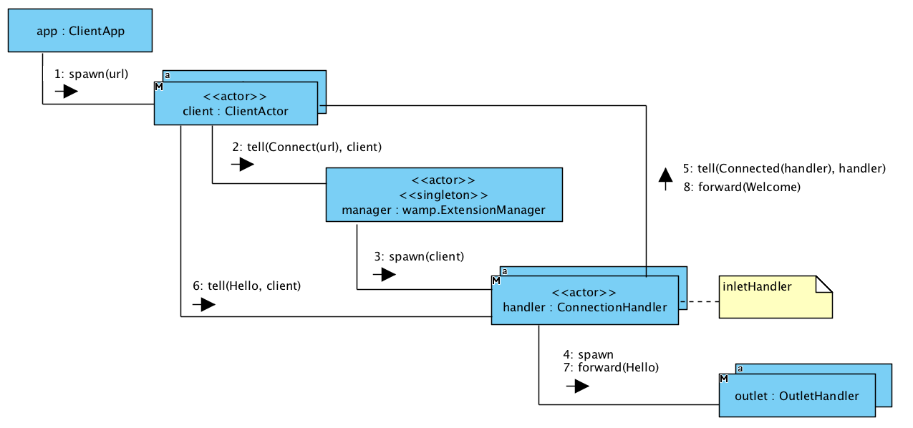

@@@ index
* [Actors](actors.md)
* [Futures](futures.md)
* [Streams](streams.md)
* [Macros](macros.md)
* [Configuration](config.md)
@@@ 

# Client APIs
Akka Wamp provides your with three Client APIs for both Java and Scala. They're all built atop the same [Akka I/O](http://doc.akka.io/docs/akka/current/scala/io.html) extension driver but they have been carefully designed to be used with different abstractions such as actors, futures and streams.

* [Actors](actors.html)   
  Low level API intended for those who needs _"full control"_ of how [Messages](../messages.html) are exchanged by peers.
  
* [Futures](futures.html)   
  High level API intended for those who wants an easy and quick solution.
  
* [Streams](streams.html)  
  Not yet supported.
  
* [Macros](macros.html)  
  Utilities meant to reduce _"boiler plate"_ code. For Scala developers only.  
   
   
## Extension manager
Akka Wamp Client APIs are all built atop of the same [Akka I/O](http://doc.akka.io/docs/akka/current/scala/io.html) extension driver named ``akka.wamp.Wamp``.

Every Akka I/O extension driver works for a specific network protocol (e.g. TCP, UDP, WAMP, etc.) and is accessible through a special actor, called the "__extension manager__", which serves as entry point for the API. You can explicitly obtain the manager actor reference as shown by the following piece of code:

scala
:    @@snip [scala-client](../../scala/docs/ScalaClientActor.scala){ #connect }

java
:    @@snip [java-client](../../java/docs/JavaClientActor.java){ #connect }

and then send command messages to it to perform basic actions as documented in the [Messages](messages.html) section.

As the manager receives a command messages (such as ``Connect``) it instantiates worker actors in response (such as ``ConnectionHandler``). Worker actors present themselves to the API user in signal messages (such as ``Connected``) replied to the command that was sent. 

 
@@@ note
Futures and streams based Client APIs will not require you to deal with the Akka I/O extension driver in such explicit manner, but rather provide you with higher level abstractions.
@@@

[scala-client]: ../../scala/docs/ScalaClientActor.scala